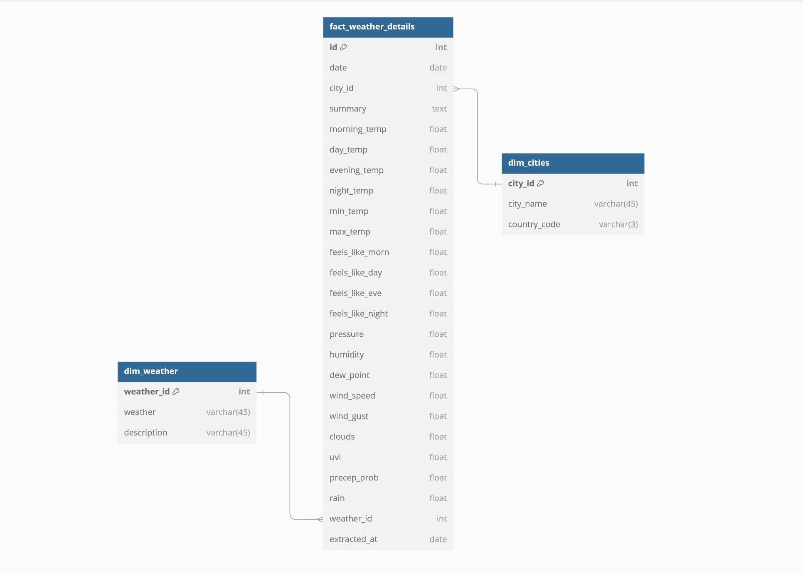
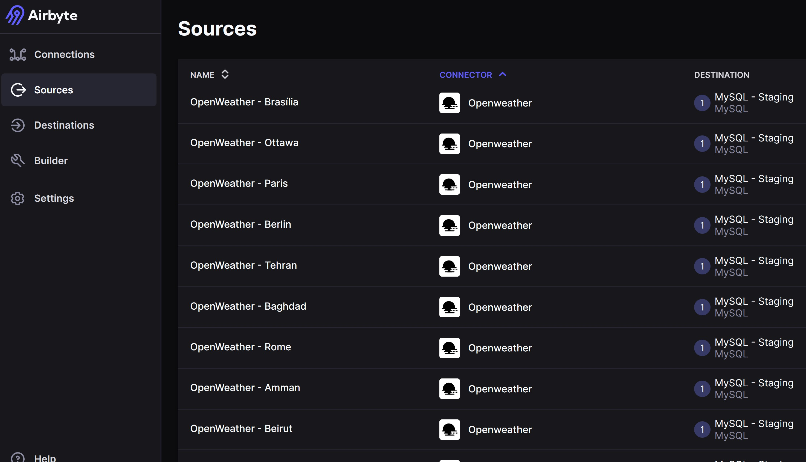
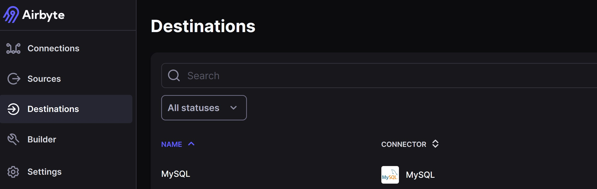
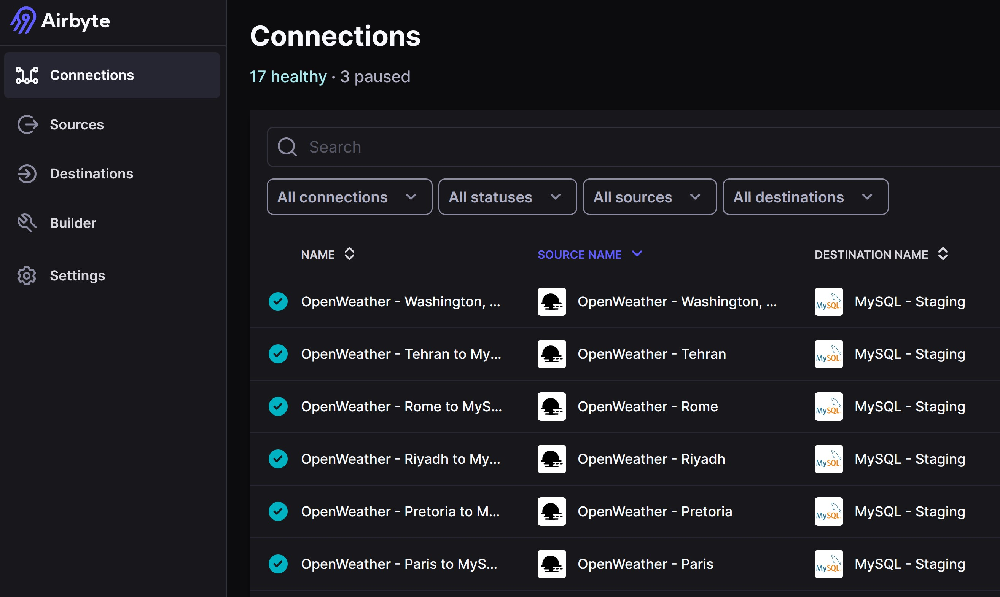
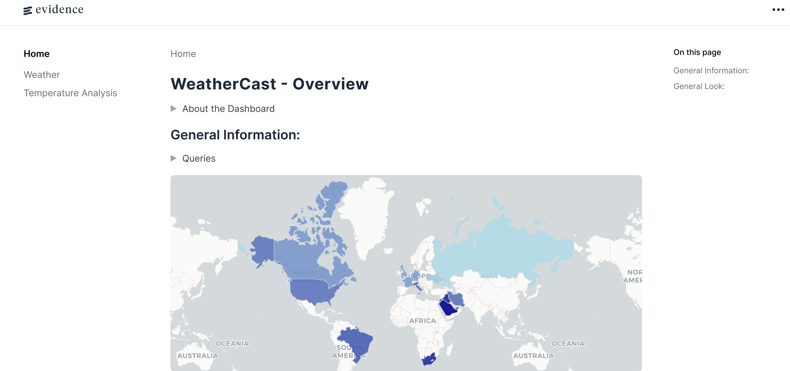
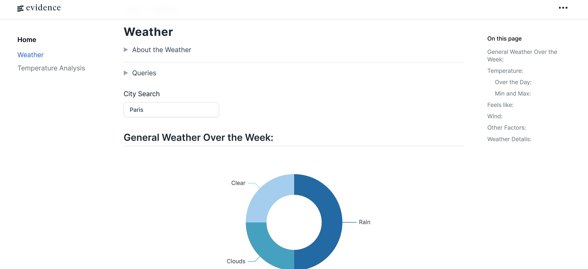
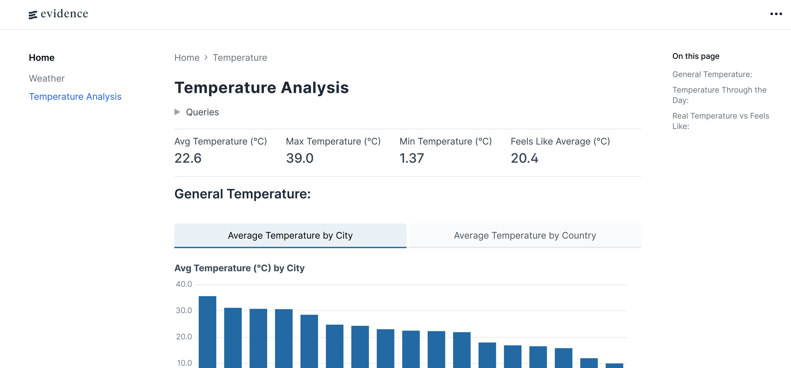
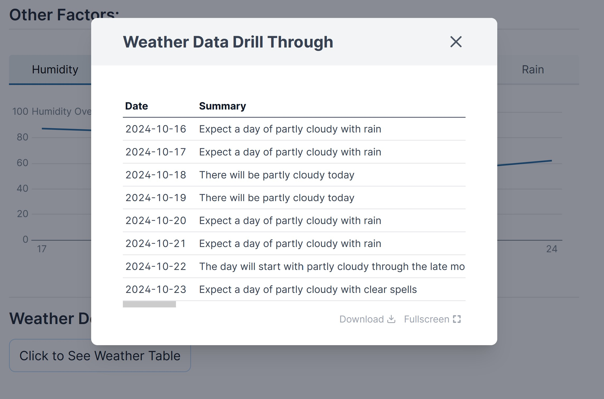

# BlinkMetrics Data Engineering Project - WeatherCast

&nbsp;&nbsp;&nbsp;&nbsp;&nbsp;

> This project aims to extract, transform, load and analyze [Open Weather One Call API](https://openweathermap.org/api/one-call-3) Data using tools like Airbyte (for EL), Looker Studio, and Evidence (for Dashboards)

## Tech Stacks:

**WeatherCast is built using the following technology:**

- **[Python 3.12.4](https://docs.python.org/3/):** A versatile programming language used for various aspects of this project, including:
  - **[Pandas](https://pandas.pydata.org/docs/index.html)**: For data manipulation and transformation.
  - **[SQLAlchemy](https://docs.sqlalchemy.org/en/20/)**: To build and maintain the connection to the data warehouse for the ETL pipeline, including modifying and accessing the data.
  - **Scripting the ETL Pipeline**: Python scripts are used to automate the transformation, and loading (TL) of data into the warehouse.
- **[SQL (Structured Query Language)](https://en.wikipedia.org/wiki/SQL)**: Used for querying within the data warehouse to facilitate both the ETL pipeline and the data analysis in the Dashbord.
- **[MySQL](https://dev.mysql.com/doc/):** A relational database management system (RDBMS) used for:
  - Storing and managing data in the data warehouse and data marts.
  - Seamless integration with Python (via `SQLAlchemy` and other libraries) and Power BI for live querying and analysis.
- **[AirByte](https://docs.airbyte.com/using-airbyte/getting-started/oss-quickstart):** open-source data integration platform that automates the extraction and loading (EL) of data.
  - [**AirByte API:**](https://docs.airbyte.com/api-documentation) API that allows programmatic access to manage and automate data integration tasks such as creating connections and syncing data within the Airbyte platform.
- **[LookerStudio](https://lookerstudio.google.com/u/0/navigation/reporting):** Business intelligence and data visualization tool that allows users to create interactive, customizable reports and dashboards by connecting to various data sources.
- **[Evidence](https://docs.evidence.dev/):** An open-source analytical reporting tool that enables teams to create data-driven reports using markdown syntax, combining SQL queries with markdown to build dynamic, shareable insights and dashboards directly from your database.

## Data Warehouse:



## Implementation:

### ETL:

- utilized the Airbyte API to create sources the extract data from then load it to it's destination (also created using the API)

- Sources:

  

- Destination:

  

- Connections: 

  

### Dashboard:

|                Overview Page                 |              **Weather Page**               |
| :------------------------------------------: | :-----------------------------------------: |
|  |  |
|         **Temperature Page Example**         |       **Drill Through Page Example**        |
|      |   |

## How to Run:

### 1. **Coding Requirements:**

> This project was built and tested on Python version `3.12.4`.

To download the requirements:

1. **Clone the Repository:**

​	``` git clone https://github.com/reinefakih/BlinkMetrics-Data-Engineering-Project```

2. **(Optional but Recommended) Set Up a Virtual Environment:**

​	```python -m venv <env name>```

3. **Install Dependencies:**

​	```pip install -r requirements.txt``` 

### 2. **Directory Guidelines**:

1. **testing:** A directory containing 4 notebooks
   1. airbyteapi_test: contains the code, logic, and tests behind creating airbyte sources, destinations, and connections.
   2. openweatherapi_test and openweather_onecall_api_test: contains the code, logic, and tests behind getting data from the Open Weather One Call API.
   3. transformations_test: contains the code, logic, tests, and details surrounding the transformations done on the data.
2. **scripts:** A directory containing the scripts to:
   1. Create the Airbyte Sources
   2. Create the Airbyte Destinations
   3. Create the Airbyte Connections
   4.  Getting the Lat and Lon of cities
   5. Transformation and Loading Scripts
3. **dashboard:** contains all the backend of the Evidence Dashboard
4. **mysql scripts:** contains two SQL scripts one for the warehouse and one for the staging area both with their data.

## Future Improvements:

1. Automating the whole ETL process and scheduling Data ingestion.
2. Adding Historical Data to aid the analysis -> can add date slicers to dashboard 
3. Fixing up the UI for both dashboards
4. Cleaning and optimizing the transformations script
5. Make the dashboard more insightful and meaningful
6. Turning the project from ETL to ELT 
